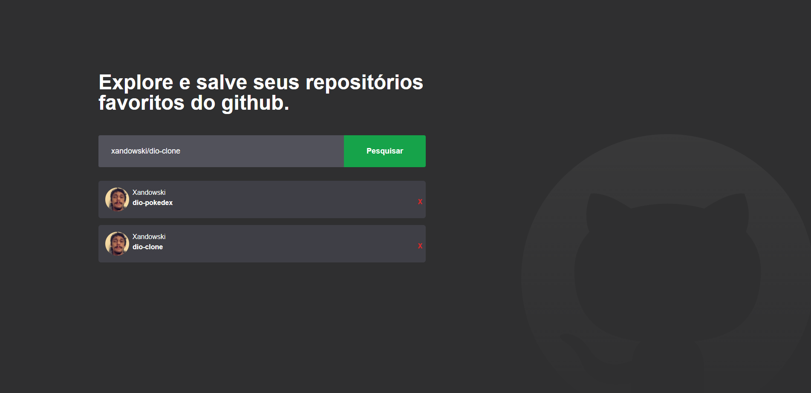

<div align="center">


<h1>DIO Github Aggregator</h1>

This application was developed during the Bootcamp <spabn>Orange Tech +</span> by [DIO](https://web.dio.me/) and [Banco Inter]().

</div>

<div align="center">

<div align="">
  
  
</div>

[]()
[]()
[]()

</div>

## ▶ Preview

[](https://dio-github-aggregator-xandowski.vercel.app/)

## 📃 About

Search for your favorites repos em save them. This app was build using Githu API.

## 🛠 Build with

<p align="center">
  <a href="https://pt-br.reactjs.org/">
    
  </a>
  <a href="https://www.typescriptlang.org/">
    
  </a>
  <a href="https://tailwindcss.com/">
    
  </a>
  <a href="https://vitejs.dev/">
    
  </a>
  <a href="https://api.github.com/">
    
  </a>
</p>

## 🎞 Demo



## 💻 Getting started

```sh
git clone https://github.com/xandowski/dio-github-aggregator.git && cd dio-github-aggregator
npm i
```

and have fun 🎉

```sh
npm run dev
```
